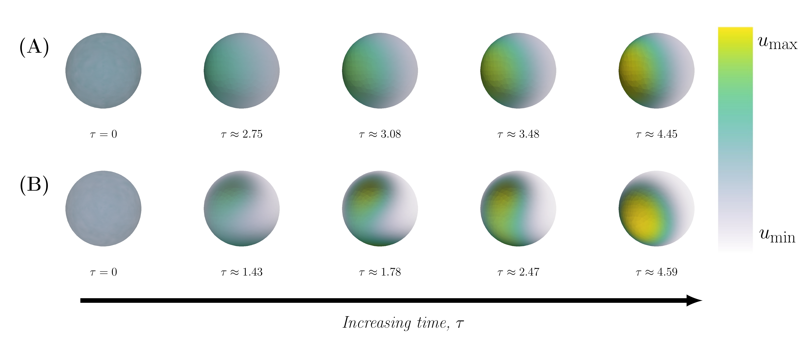

# About 
This is the Github repositry of the manuscript ``Cell polarisation in a bulk-surface model can be driven by both classic and non-classic Turing instability''[1]. The model simulates the process called Cdc42-mediated cell polarisation which is essential for multiple processes such as cell division and cell migration for a wide variety of cells ranging from yeast to human beings. During this process, the protein Cdc42 belonging to the class of Rho-GTPases gets activated and inactivated as well as being transported from the interior of the cell (the cytosol) to the surface of the cell (the cell membrane) through a set of chemical reactions. Simultaneously,it moves in space through diffusion, and it is this combination of reaction and diffusion that ultimately causes the aggregation of the active component of cdc42 in one spot on the cell membrane called the pole. Recent attempt to model this process has included a three dimensional description of the cell including both the cytosol (i.e. a bulk) and the membrane (i.e. a surface) [2,3], and for this type of **bulk-surface models** there are two types of mechanisms that can cause pattern formation. These are so called *classic Turing instability* (Fig 1A) and a more recent version referred to as *non-classic Turing instability* (Fig 1B).  

In this paper, based on the structure of a previous model [2,3] we propose a simpler and (what we argue for) a more biologically realistic bulk surface model of Cdc42-mediated cell polarisation. We conduct mathematical analysis in order to conclude that the solutions to the proposed model are physically reasonable. Then, we conduct a numerical investigation of the parameter space in order to map out the sets of parameters that give rise to the classic and non-classic type of Turing instability. Lastly, based on this numerical description of the parameter space, we select parameters giving rise to cell polarisation (at least theoretically) and we validate our results using numerical simulations of the reaction diffusion model. The numerical simulations are based on a combined approach using the *Finite Element Method (FEM)* [4] in space together with an *adaptive Finite Difference (FD)* [5] approach in time. Using these simulations, we investigate the effect of changing the involved rate parameters on three different properties: the minimal and maximal concentration of cdc42 on the cell membrane, the polarisation time being the time it takes for the pole to be formed and the ratio between the area of the pole relative to the surface of the cell membrane. In particular, we investigate two key parameters being the relative diffusion between the inavtive and active state of cdc42 denoted d and the relative reaction strength gamma which is directly proportional to the surface area of the cell membrane.  

In this repository, a script for generating the numerical description of the parameter space as well as two scripts for simulating the cdc42-mediated cell polarisation caused by diffusion driven instability are available in the ``Code'' folder. Here, code for processing and formatting the meshes, i.e. the spatial discretisations, used in the FEM are also found. In addition, code for analysing the results, i.e. the output data, from the FEM-FD simulations is presented as well as code for generating multiple figures presented in the article. 

## Repository structure
The following folders are contained in the repositry: 

- **Code:** The folder contains the scripts for running the FEM-FD algorithm for simulating the evolution of the RD system, it contains the script for generating a plot of the parameter space which determines which parameters that give rise to classic and non-classic Turing instability, it contains the script for creating the meshes used in the FEM-FD algorithm which corresponds to the spatial approximation of the cell, it contains a script for calculating the steady states of the homogeneous system which are used when setting the initial conditions in the FEM-FD algorithm and lastly it contains a script for analysing the results or "data" obtained from a running the "increasing gamma" and "increasing d" experimental designs. 
- **Results:** It contain "data files" or "output files" from the FEM-FD script corresponding to the experimental designs "increasing gamma" and "increasing d".  
- **Figures:** It contain folders for generating the different types of figures presented in the article. All figures are generated in LaTeX but some of them are drawn directly in LaTeX (e.g. the schematic figure of the reaction mechanism of Cdc42) whereas others includes external figures generated from other scripts (e.g. as the eps figures generated from the Matlab script in the parameter plot of the Turing space) or softwares (e.g. the eps figures of the concentration profiles of active Cdc42 generated from ParaView). 

Each of the sub folders in these three major folders contains their own ``README.md'' files which explains the details of how each script and software are used in the project.

## Requirements for reproducing the result
This section contains information of operating system, programming languages (with libraries) and software required to reproduce the results.

### Operating system
The repositry was created on a computer with the operating system Ubuntu 18.04.5 with the kernel Linux 4.15.0-118-generic.There are some shell scripts for running the scripts and on the mentioned computer a bash terminal has been used. In addition, the python scripts have been executed on two other local clusters residing in the building of the Department of Mathematical Sciences at the University of Gothenburg. The first one is called "Ozzy" which has 56 CPUs running on the operating Ubuntu 18.04.4 with kernel Linux 4.15.0-118-generic and the second one is called "Gantenbein" with 112 CPUs on the operating system Red Hat 10.1.1-1 with kernel Linux 4.15.0-101-generic. The easiest way to run the Python-scripts is through anaconda (see the Python subsection of the section on programming languages below) which requires a local installation on the computer you are working on. 

### Programming languages
The scripts have been generated through both Python (version 3.8.3) and Matlab (release name R2018b version 9.5). 

#### Python
The three main libraries for executing the scripts of the FEM-FD algorithm are:

1. numpy (version 1.18.5),
2. pandas (version 1.0.5),
3. The [FEniCS](https://fenicsproject.org/) [6] packages (version 2019.1.0) including the DOLFIN [7] library. 

However, there are more required packages and the easiest way to get hold of them is to use the package manager [anaconda](https://docs.anaconda.com/anaconda) (for this project, the version 2020.07 of anaconda has been used). The [local installation](https://docs.anaconda.com/anaconda/install/) of anaconda depends on your operating system, and then all relevant packages for this repositry can be accesed through the file "cd42.yml". This is done with running the command "conda env create -f cdc42.yml" (for more information see the following [link](https://docs.conda.io/projects/conda/en/latest/user-guide/tasks/manage-environments.html)). Thereafter, one has to activate the conda environment through "conda activate cdc42" and then one can execute the FEM-FD scripts provided that the installation of the packages was succesful. 

#### Matlab
In the script "parameterSpacePlot\_NewtonIteration\_20190120.m" for generating the Turing mapping of the parameter space in the folder "Code/MappingTheTuringParameterSpace\_Matlab" a so called ["parfor"-loop](https://se.mathworks.com/help/matlab/ref/parfor.html) is used to speed up the efficiency of the calculations when the resolution of the resulting image is high. The resolution of the image in this case is determined by the parameter "nuOfIter" (e.g. nuOfIter = 1500 on line 48 of "parameterSpacePlot\_NewtonIteration_20190120.m") and if the resolution is lowered it is recommended to change to parfor-loop on line 147 to a regular for-loop. 

### Software
There are two softwares used in the project. 

1. [Gmsh](https://gmsh.info/) [9] (version 3.6.0) is used to generate the finite element meshes,
2. [ParaView](https://www.paraview.org/) [8] (version 5.4.1) is used for visualising the concentration profiles of active cdc42 during the polarisation process. 

A more detailed descritption of how Gmsh was used in this repositry can be found in the README.md file in the folder "Code/GenerateFEMmesh_GmshAndPython" and a more detailed description of how Paraview was used in this repositry can be found in the README.md in the "Results"-folder. 

# References
1. Borgqvist, Johannes, et al. "Cell polarisation in a bulk-surface model can be driven by both classic and non-classic Turing instability." bioRxiv (2020).
2. Rätz, Andreas, and Matthias Röger. "Turing instabilities in a mathematical model for signaling networks." Journal of mathematical biology 65.6-7 (2012): 1215-1244.
3. Rätz, Andreas, and Matthias Röger. "Symmetry breaking in a bulk–surface reaction–diffusion model for signalling networks." Nonlinearity 27.8 (2014): 1805.
4. Larsson, Stig, and Vidar Thomée. Partial differential equations with numerical methods. Vol. 45. Springer Science & Business Media, 2008.
5. Cheney, E. Ward, and David R. Kincaid. Numerical mathematics and computing. Cengage Learning, 2012.
6. Alnæs, Martin, et al. "The FEniCS project version 1.5." Archive of Numerical Software 3.100 (2015). 
7. Logg, Anders, and Garth N. Wells. "DOLFIN: Automated finite element computing." ACM Transactions on Mathematical Software (TOMS) 37.2 (2010): 1-28.
8. Ahrens, James, Berk Geveci, and Charles Law. "Paraview: An end-user tool for large data visualization." The visualization handbook 717 (2005).
9. Geuzaine, Christophe, and Jean‐François Remacle. "Gmsh: A 3‐D finite element mesh generator with built‐in pre‐and post‐processing facilities." International journal for numerical methods in engineering 79.11 (2009): 1309-1331.
