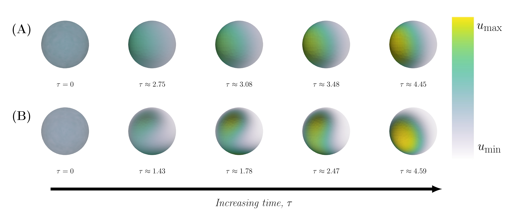

# About 
This is the Github repositry of the manuscript ``Cell polarisation in a bulk-surface model can be driven by both classic and non-classic Turing instability''<cite>[1]<cite>. The model simulates the process called Cdc42-mediated cell polarisation which is essential for multiple processes such as cell division and cell migration for a wide variety of cells ranging from yeast to human beings. During this process, the protein Cdc42 belonging to the class of Rho-GTPases gets activated and inactivated as well as being transported from the interior of the cell (the cytosol) to the surface of the cell (the cell membrane) through a set of chemical reactions. Simultaneously,it moves in space through diffusion, and it is this combination of reaction and diffusion that ultimately causes the aggregation of the active component of cdc42 in one spot on the cell membrane called the pole. Recent attempt to model this process has included a three dimensional description of the cell including both the cytosol (i.e. a bulk) and the membrane (i.e. a surface) <cite>[2,3]<cite>, and for this type of **bulk-surface models** there are two types of mechanisms that can cause pattern formation. These are so called ***classic Turing instability***(Fig 1A) and a more recent version referred to as ***non-classic Turing instability***  (Fig 1B).  

# References
1. ``Cell polarisation in a bulk-surface model can be driven by both classic and non-classic Turing instability''
Johannes Borgqvist, Adam Malik, Carl Lundholm, Anders Logg, Philip Gerlee, Marija Cvijovic
bioRxiv 2020.01.29.925628; doi: https://doi.org/10.1101/2020.01.29.925628 
2.
