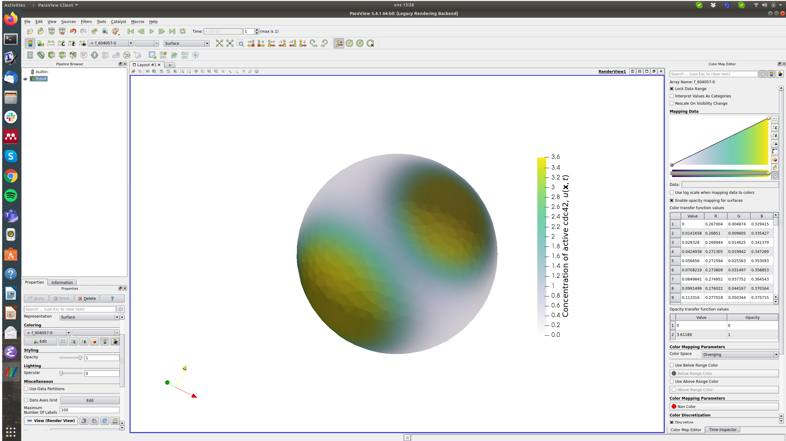

# The results or output from the FEM-FD simulations
Here, the results of the two experimental designs "increasing gamma" and "increasing d" composed of numerous the FEM-FD simulations are saved. These can be classified into two categories: the three metrics of cell polarisation and visualisation of the evolution of the concentration profile of active cdc42. 

## The three metrics of cell polarisation 
In figure the figures corresponding to the two experimental designs (see "Figures/increasing\_gamma" and "Figures/increasing\_d"), the effects of increasing the two parameters gamma and d on *three important metrics* are investigated. These three metrics are *the maximum and minimum concentration of active cdc42 on the cell membrane*, *the time to polarisation* and *the ratio of the area of the pole and the total area of the membrane*. These are measured for the two experimental designs corresponding to "increasing gamma" and "increasing d". Within each of these two cases, simulations using the FEM-FD algorithm have been conducted for 20 different runs and thus there are 20 folders within both the "Classical" and the "NonClassical" subfolder numbered from 1 to 20. Within each of these runs, there are four csv files: 

1. "uMin.csv": the minimum concentration of active cdc42 for each value of gamma or d,
2. "uMax.csv": : the maximum concentration of active cdc42 for each value of gamma or d,
3. "tPole.csv": : the polarisation time for each value of gamma or d,
4. "ratioPole.csv": : the ratio between the area of the pole and the toal area of the membrane for each value of gamma or d,
5. "gammaVec.csv" or "dVec.csv" depending on the experimental design: the values of gamma or d. 

These data files are processed by the Matlab script in "Code/" which then produces the files which are used for producing the plots in "Figures/" and "Figures/" respectively. 

## The visualisation of the concentration profile of active cdc42 using *ParaView*
The concentration profiles of the components of the RD model can be saved into files which can later be visualised in ParaView. In the case of the implemented FEM-FD algorithm, each individual time step is saved in a so called vtu-file, and all of these time steps are collected in a pvd-file. If one goes to one of the 20 cases saved in the folders for the experimental design (e.g. "Results/increasingGamma/Classical/1/") there are two vtu-files called "0000000.vtu" and "0000001.vtu" which corresponds to the initial condition and the last time step. All of these are collected in a pvd-file called "0.pvd" which can be opened and visualised in ParaView (Fig 2). 

If one wishes to generate a movie of the evolution of the concentration profile one has to save more time steps in the FEM-FD algorithm. This is done on by uncommenting the if-statements on the lines 398-405 in the file "FEMandFD_solver_ImpExp_linear_tAdaptive_PoleFinder.py" in the folders "/Code/FEMFD\_AlgorithmForSolvingTheRDsystem\_FEniCSandPython/increasing\_gamma/ScriptsToRun" and "/Code/FEMFD\_AlgorithmForSolvingTheRDsystem\_FEniCSandPython/increasing\_d/ScriptsToRun". On these specific lines an image is saved every 100th step and the reason why these images are not saved is because they take up much memory. However, given the corresponding pvd-file one can run the simulations and one can also export individual images for each time step in different formats. This is done by clicking on "File>Export Scene", and this is the methodology that has generated the individual eps-figures found in "Figures/evolutionPattern/Pictures". 

There are multiple tutorials of how to use [ParaView](https://www.paraview.org/tutorials/) available. 
